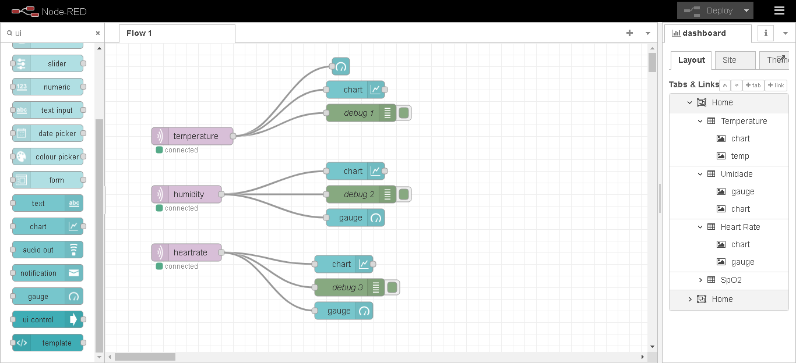
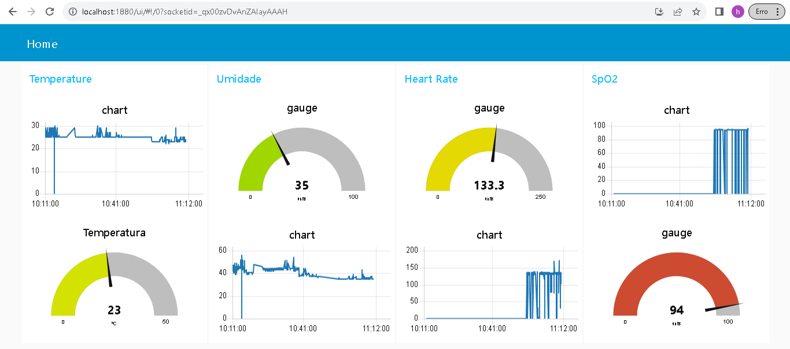
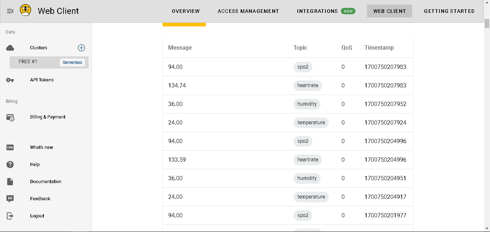
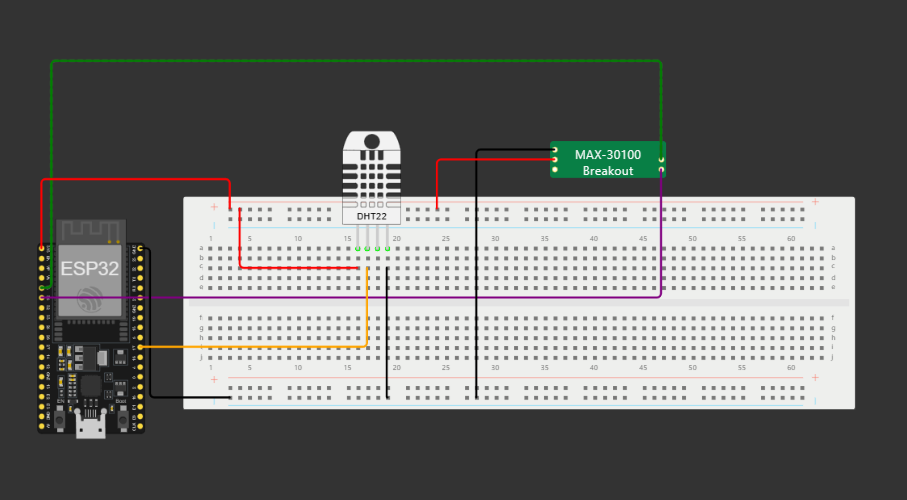

<h1>Global Solution - IOT</h1>
<h2>Videos</h2>

IOT: https://youtu.be/QOUhJHxvsL8?si=jTxS1FDwRQT8z1Xv

<h2>Integrantes</h2>
<ul>
    <li>Nome: Higor Alves Santos | RM: 93359</li>
    <li>Nome: Karina Conceição Machado da Costa | RM: 96164</li>
    <li>Nome: Lucas Marques de Souza | RM: 95418</li>
    <li>Nome: Giovanna Santos Viana | RM: 95813</li>
</ul>

<h2>Info</h2>
<ul>
    <li>MQTT Broker: HiveMQ</li>
    <li>Hardware: ESP32</li>
    <li>Sensor 1: DHT11</li>
    <li>Sensor 2: MAX30100</li>
</ul>

O sensor DHT11 é responsavel por ler a umidade e a temperatura do ambiente, já o sensor MAX30100, é responsável por ler dados do usuário como batimentos cardiacos e pressão arterial

<h3>Fluxo Node-Red</h3>

<h3>Gráficos</h3>

<h3>MQTT</h3>

<h3>Circuito</h3>

Preste atenção as portas, mude de acordo com a sua necessidade

